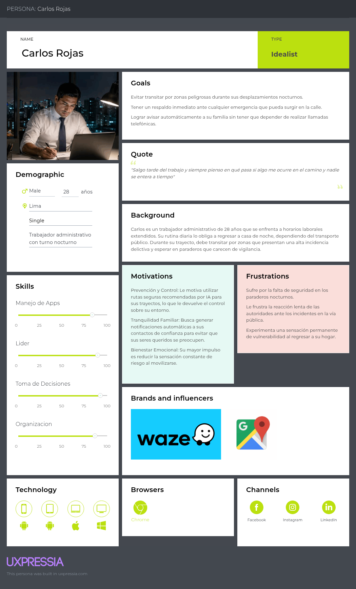

## 2.3.1. User Personas

### Segmento #1: Estudiantes

Valeria Torres es una estudiante de 20 años de Ingeniería de Software en la UPC, residente en San Martín de Porres. Representa al segmento de jóvenes universitarios que deben retornar a sus hogares en horarios nocturnos, enfrentando trayectos largos que combinan transporte público y caminatas por zonas con baja iluminación. Su objetivo principal es contar con mecanismos de seguridad discretos y eficientes que le permitan reportar su estado sin la necesidad de manipular visiblemente su teléfono celular en la vía pública.

### Segmento #2: Trabajadores

Carlos Rojas es un trabajador administrativo de 28 años en Lima con turnos nocturnos extendidos. Representa al segmento de la población laboral que depende diariamente del transporte público y transita por paraderos desatendidos en zonas con alta incidencia delictiva. Su necesidad central se enfoca en disponer de alertas rápidas de un solo toque y mapas de riesgo actualizados que le garanticen una conexión inmediata con sus familiares ante cualquier eventualidad en el trayecto.

